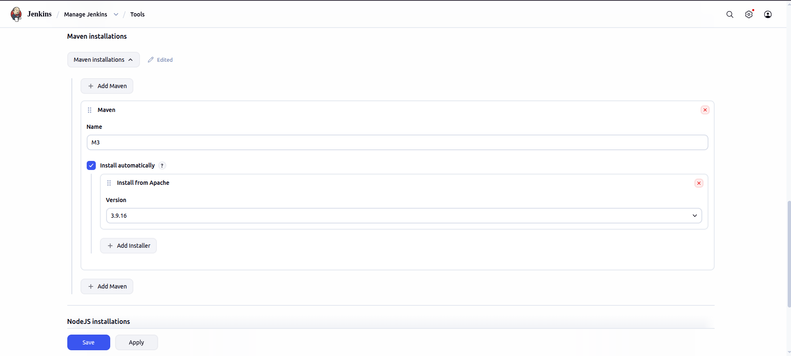
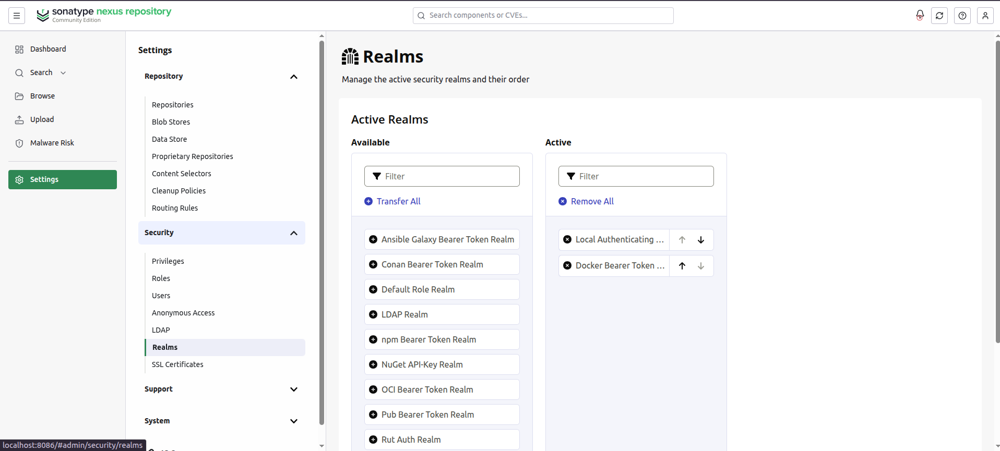

# CI/CD Pipeline Setup

This project uses a Jenkins Declarative Pipeline to automate testing, code quality analysis, artifact deployment, Docker image publishing, and application deployment.

---

# Pipeline Overview

The pipeline performs the following steps:

1. Backend Unit Tests (Maven)
2. Frontend Unit Tests (Node.js)
3. SonarQube Static Code Analysis
4. SonarQube Quality Gate Validation
5. Package & Deploy Maven Artifacts to Nexus
6. Build & Push Docker Images (only on Git tags)
7. Deploy the Docker Compose Stack
8. Send Email Notifications
9. Automatic Rollback on Failure

---

# Prerequisites

The Jenkins server must have the following installed.

## Software

- Jenkins
- Java 17+
- Maven
- Docker
- Docker Compose
- Git

---

## Jenkins Plugins

Install the following plugins:

- Pipeline
- Docker Pipeline
- Config File Provider
- SonarQube Scanner
- NodeJs
- Basic Branch Build Strategies Plugin

---

# Jenkins Global Configuration

## 1. Maven

Go to:

```
Manage Jenkins
→ Tools
→ Maven Installations
```

Create a Maven installation named:

```
M3
```


---

## 2. SonarQube

Go to:

```
Manage Jenkins
→ System
→ SonarQube Servers
```

Add a server named:

```
MySonarServer
```

Configure:

- Server URL e.g  http://sonarqube:9000
- Authentication Token

---

## 3. Maven Settings.xml

Go to:

```
Manage Jenkins
→ Managed Files
```

Create a `Maven settings.xml`.

Its ID looks something like this:

```
754548c3-5658-428e-8784-4b6757341553
```

The file should contain the credentials for your Nexus repository.

Example:

```xml
<settings>

  <servers>

    <server>
      <id>nexus-releases</id>
      <username>YOUR_USERNAME</username>
      <password>YOUR_PASSWORD</password>
    </server>

    <server>
      <id>nexus-snapshots</id>
      <username>YOUR_USERNAME</username>
      <password>YOUR_PASSWORD</password>
    </server>

  </servers>

   <mirrors>
		 <mirror>
			  <id>nexus</id>
			  <mirrorOf>*</mirrorOf>
			  <url>http://hostname:port/repository/repository-name/</url>
		 </mirror>
  </mirrors>

</settings>
```

---

## 4. Jenkins Credentials

Create the following credentials.

### Nexus Credentials

Credential ID:

```
NEXUS_CREDENTIALS
```

Type:

```
Username with Password
```

Used for:

```
docker login localhost:8086
```

---

### Git Credentials

Credential ID:

```
github pull credentials
```

Type:

```
Username with Password
```

Used for:

- Automatic rollback
- Automatic push of revert commits

---

# Nexus Repository

The pipeline expects a Nexus Repository running locally.

Example Docker Registry:

```
localhost:8086
```

Maven repositories should also be configured in Nexus for:

- Releases
- Snapshots

Nexus needs Docker Bearer Token Realm:
- go to settings -> security -> Realms -> add Docker Bearer Token Realm
- order matters



---

# SonarQube

A SonarQube server must be running.

The pipeline uses:

```
Project Key:
buy02

Project Name:
buy02
```

The Quality Gate must pass before deployment continues.

---

# Docker Compose

A `docker-compose.yml` file must exist at the root of the project.

The compose file should define every microservice and build context.

---

# Branch Builds

When a normal branch is built, the pipeline executes:

- Backend Tests
- Frontend Tests
- Sonar Analysis
- Quality Gate
- Maven Deploy
- Docker Compose Deployment

Docker images are **not** pushed.

---

# Tagged Releases

When building a Git tag (for example `v1.0.0`), the pipeline additionally:

- Builds Docker images
- Pushes images to the Docker Registry

Version numbers are derived from the Git tag.

Example:

```
Tag:
v1.2.0

Artifact Version:
1.2.0
```

If no tag exists, the version becomes:

```
<commit-hash>-SNAPSHOT
```

Example:

```
2f4bc2a1-SNAPSHOT
```

---

# Running the Pipeline

## 1. Create a Multibranch Pipeline

In Jenkins:

```
New Item
→ Multibranch Pipeline
```

Give the job a name and click **OK**.

---

## 2. Configure the Branch Source

Under **Branch Sources**, click **Add source** and select **Git** (or your Git provider, such as Gitea or GitHub).

Provide:

- Repository URL
- Credentials (if the repository is private)

Jenkins will automatically discover all branches containing a `Jenkinsfile`.

---

## 3. Configure Build Triggers

Enable **Scan Multibranch Pipeline Triggers** if you want Jenkins to periodically scan the repository for new branches and changes.

The pipeline itself also defines:

- **SCM Polling** using `pollSCM('')`
- A scheduled **cron** trigger for automated monitoring scans on weekday nights.

---

## 4. Save

Click **Save**.

Jenkins will perform an initial scan of the repository and create jobs for each discovered branch.

---

## 5. Run the Pipeline

To build a specific branch:

1. Open the Multibranch Pipeline job.
2. Select the desired branch (e.g., `main`, `develop`, or a feature branch).
3. Click **Build Now**.

Jenkins will execute the `Jenkinsfile` from that branch.

---

## 6. Building Tagged Releases

When a Git tag (e.g., `v1.0.0`) is pushed, Jenkins detects the tag (if tag discovery is enabled in the Multibranch Pipeline configuration) and executes the pipeline.

During tagged builds, the **Build Images & Push** stage is executed, publishing Docker images to the configured Nexus Docker registry.

# Automatic Triggers

The pipeline is configured with:

## SCM Polling

```groovy
pollSCM('')
```

Jenkins periodically checks the repository for changes and triggers a build when new commits are detected.

---

## Scheduled Scan

```groovy
cron('H H(0-4) * * 1-5')
```

This schedules a build every weekday between **12:00 AM and 4:59 AM** (the exact time is automatically distributed by Jenkins using `H`) for maintenance and monitoring.

---

# Deployment

During deployment, the pipeline:

Creates the Docker network if it does not exist:

```bash
docker network create shared-net
```

Stops the currently running stack:

```bash
docker compose -p buy01-current down --remove-orphans
```

Starts the updated stack:

```bash
docker compose -p buy01-current up -d
```

---

# Test Reports

JUnit reports are automatically archived from:

```
**/target/surefire-reports/*.xml
```

and

```
frontend/junit-frontend.xml
```

These reports can be viewed directly in Jenkins after each build.

---

# Email Notifications

On success, Jenkins sends a notification email containing the build URL.

On failure, Jenkins sends an alert email with a link to the console logs.

---

# Automatic Rollback

If the pipeline fails:

1. Jenkins creates a revert commit for the latest change:

```bash
git revert HEAD --no-edit
```

2. The revert is automatically pushed to the `main` branch using the configured Git credentials.

This mechanism helps restore the repository to the last known good state after a failed pipeline execution.

---

# Pipeline Flow

```
Git Commit
     │
     ▼
Backend Unit Tests
     │
     ▼
Frontend Unit Tests
     │
     ▼
SonarQube Analysis
     │
     ▼
Quality Gate
     │
     ▼
Package & Deploy Artifacts
     │
     ▼
Is Build a Git Tag?
     │
 ┌───┴───────────┐
 │               │
No             Yes
 │               │
 ▼               ▼
Deploy      Build Docker Images
Stack           │
                ▼
          Push Images to Nexus
                │
                ▼
           Deploy Stack
                │
                ▼
        Email Notification
                │
                ▼
      Rollback on Failure
```